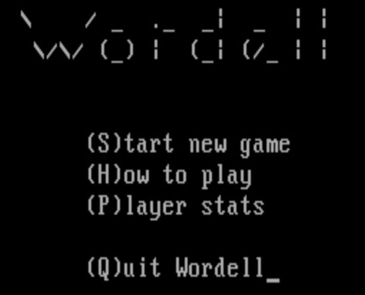
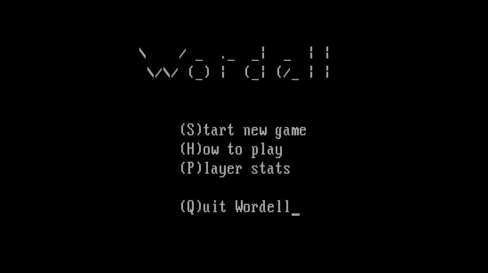
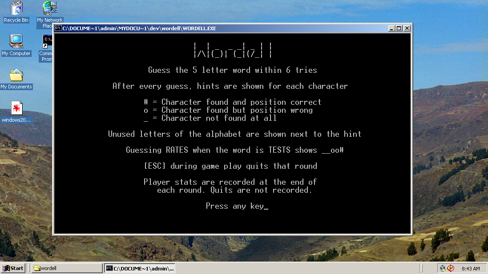
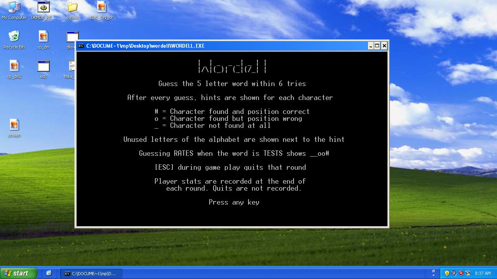
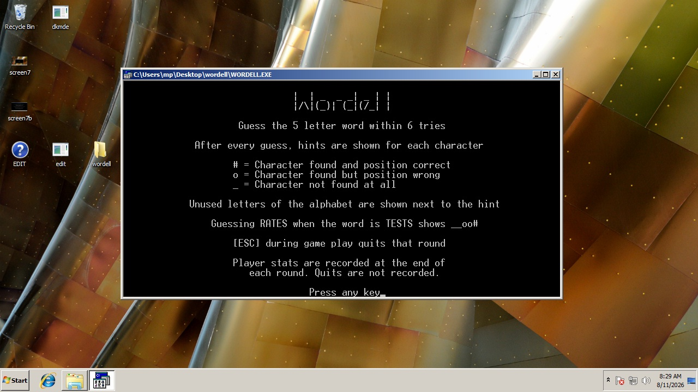

## Wordell: A Wordle Clone for MS-DOS 3.3

Wordell for DOS 3.3 is a Wordle clone written in Microsoft C 4.0. It features
2,315 possible unique games.

DOS 3.3 was chosen as a middle ground: old enough to run on a wide range
of machines, while still supporting a future
[Windows 1.0 version](https://github.com/mpower-codeworks/WORDELL-Wordle-Clone-for-Windows-1.0).

Wordell for DOS 3.3 is nearly identical to the
[Apple II version](https://github.com/mpower-codeworks/WORDELL-Wordle-Clone-for-Apple-II),
with only the platform-specific portions changed for DOS. The game logic, word
handling, rules, and overall presentation remain the same; changes are largely
limited to screen output and formatting, keyboard input, file access, and a
small amount of system-specific code needed to build and run on MS-DOS.

Three files are needed to run the program. `WORDELL.exe`, `ALL5.bin` and `SOL5.bin`. Player
stats file `WORDELL.ini` is automatically created by the program upon the first win/lose
scenario.

## Screenshots

<table>
    <tr>
        <td align="left" width="50%" valign="middle">
             
            DOS mode - Identical to Apple II version
        </td>
        <td align="left" width="50%" valign="middle">
             
            DOS Version on Windows 2000
        </td>
    </tr>
    <tr>
        <td align="left" width="50%" valign="middle">
             
            DOS Version on Windows XP
        </td>
        <td align="left" width="50%" valign="middle">
             
            DOS Version on Windows 7 (32-bit only)
        </td>
    </tr>
</table>

## Building the Source Code

Setting up MS C 4.0 is a beast (at least it was for me). I can't type all that out here.
If you want to build and get stuck, email me and I can look though my setup or I can just
send you a working image. That's probably easiest. 
